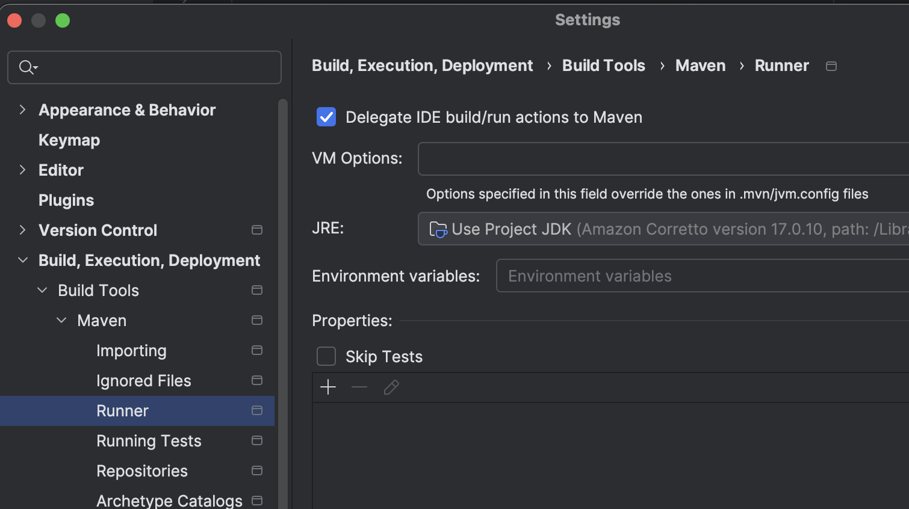
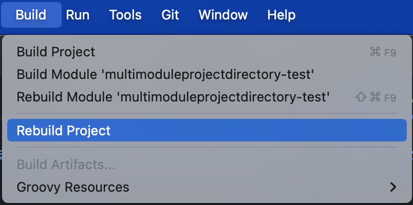
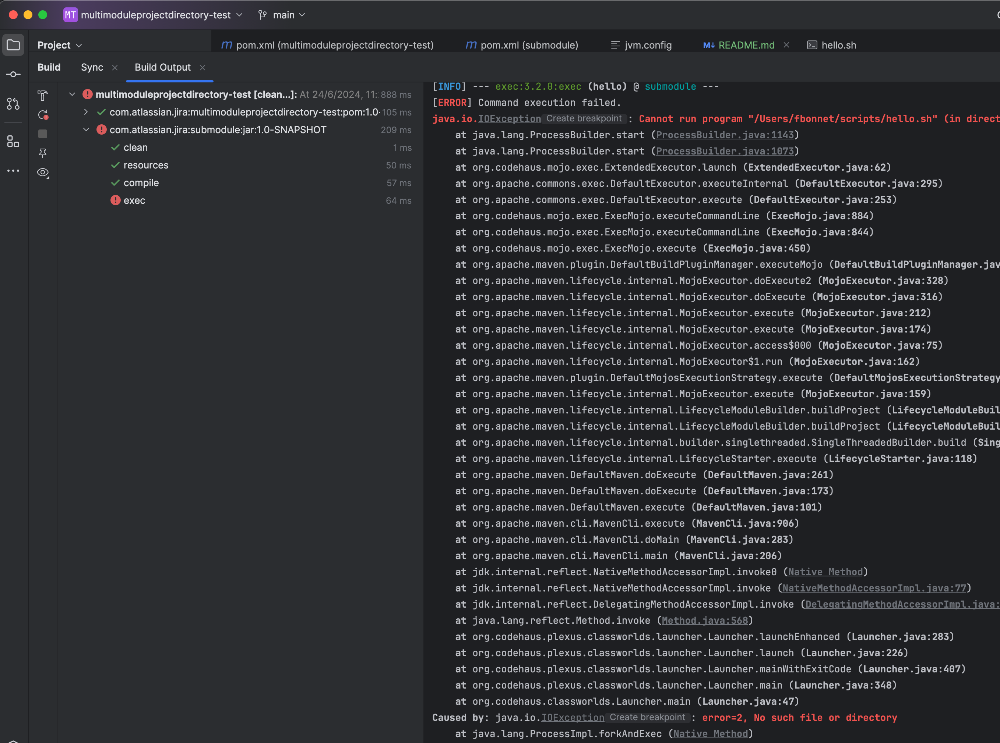

This project is used to reproduce the issue described on this page:
https://intellij-support.jetbrains.com/hc/en-us/community/posts/19668845822738-Incorrect-value-for-maven-property-multiModuleProjectDirectory

The project works fine when using maven CLI `mvn clean compile`

To reproduce the issue in IntelliJ:
- import the project as a maven project in IntelliJ (I am using IntelliJ IDEA 2024.1.3 (Ultimate Edition))
- configure IntelliJ to delegate builds to maven 
- build or rebuild the project using the menu 
- the build fails with this error:

IntelliJ seem to be setting `maven.multiModuleProjectDirectory` to the user directory instead of the parent module directory